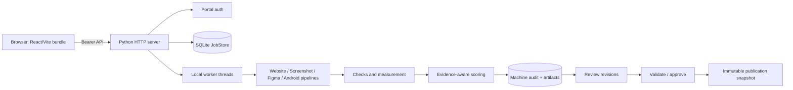
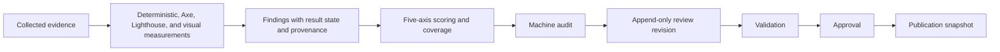
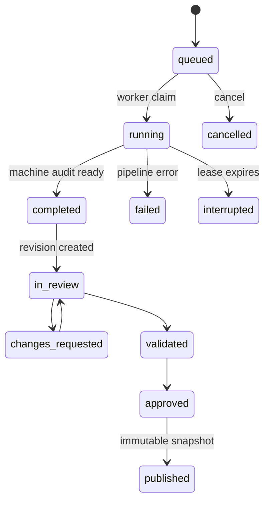

# Architecture

**Status:** Current implementation
**Repository baseline:** `main @ b49d8ac0ca9b89da97629c734fa50d5245b5420b`
**Last updated:** 2026-09-10
**Audience:** Developers, operators, and technical stakeholders
**Scope:** Implemented components, flows, boundaries, and constraints.
**Related documents:** [Technical Specification](TECHNICAL-SPECIFICATION.md), [Data Model](DATA-MODEL.md), [Decisions](DECISIONS.md).

## System/component view

The deployed application is one Python application instance with local worker threads and pipeline subprocesses. The frontend source is React/Vite; `npm run build` emits `src/ui/static/app/`, which the Python server serves. Vite is not a production service and the production UI does not rely on a framework CDN.

## Audit and report flow

Website mode discovers a bounded representative sample, collects Playwright evidence and conservative interactions, then writes job-local artifacts. Screenshot mode analyses validated uploads; Figma mode fetches/normalizes authorized design data and annotations; Android mode uses trusted Appium/ADB capture with bounded exploration. Screenshot and live-mobile jobs are disabled in supplied Render configuration.

## Job, review, and publication lifecycle

Editing is not validation; validation is not approval; approval is not publication. Revisions are append-only, optimistic conflicts return HTTP 409, and publication names an explicit revision. The machine-unreviewed path remains distinct. Publication uses an immutable snapshot and does not accept arbitrary edited HTML.

## Evidence, measurement, scoring, and storage

Result semantics preserve outcome, applicability, measurement state, stable IDs, and provenance; legacy workbook labels are an adapter. Collection coverage describes selected-page collection. Measurement coverage is measured applicable rule weight divided by applicable rule weight and affects confidence/coverage rather than adding score credit. Axe automation and Lighthouse are tool-backed measurements; Lighthouse values are lab data, not field metrics. Visual-model results are probabilistic, schema-validated interpretations.

SQLite owns jobs/events, review revisions/events, and publication snapshots. Website workspaces contain collection, measurement, evidence and report artifacts; generated reports remain filesystem artifacts. SQLite/local files are single-instance infrastructure, not a distributed queue/store.

## Trust, deployment, and recovery

Portal bearer authentication, ownership checks, request limits, SSRF/DNS/browser guards, and static-asset route controls form the primary trust boundary. External dependencies are portal auth, public websites, Figma, AI providers, Appium/ADB, Lighthouse/Axe tooling, and optional Vercel publication. Timeouts, cancellation, retries, and leases persist errors/events; expired leases become interrupted rather than silently rerunning.

Docker and supplied Render deployment run a single application instance. Durable criteria and retained artifacts on ephemeral deployments require external persistent storage. Related decisions: [ADR-002](DECISIONS.md#adr-002-local-sqlite-job-store), [ADR-004](DECISIONS.md#adr-004-representative-sampling-and-coverage), [ADR-006](DECISIONS.md#adr-006-rich-result-semantics-and-provenance), [ADR-008](DECISIONS.md#adr-008-explicit-publication).
