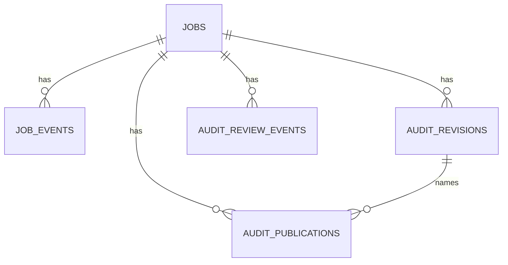

# Data Model

**Status:** Current baseline storage and artifact model
**Repository baseline:** `main @ b49d8ac0ca9b89da97629c734fa50d5245b5420b`
**Last updated:** 2026-09-10
**Audience:** Developers, maintainers, and operators
**Scope:** SQLite truth, workspace/artifact JSON, and derived reports.
**Related documents:** [Architecture](ARCHITECTURE.md), [Product Specification](PRODUCT-SPECIFICATION.md), [Technical Specification](TECHNICAL-SPECIFICATION.md).

## SQLite schema

`shared/state/jobs.sqlite3` is authoritative for one application instance (or configured `sqlite:///` path). `JobStore` owns migration schema version `3` through `schema_migrations`.

| Table | Key fields and constraints |
| --- | --- |
| `jobs` | `id` TEXT PK; non-null owner/type/payload/status/stage/progress; result/error, cancellation, worker/lease, attempt, publication, retention fields and timestamps. |
| `job_events` | INTEGER autoincrement PK; non-null `job_id` FK to jobs with `ON DELETE CASCADE`; level/event/message/request/worker metadata. |
| `audit_revisions` | `revision_id` TEXT PK; non-null `audit_id` FK, reviewer identity/role, state, changes JSON, reason and creation time; optional base revision, validation/approval times. |
| `audit_review_events` | INTEGER autoincrement PK; non-null audit/actor/event/timestamp; optional revision and request IDs; audit FK cascades. |
| `audit_publications` | `publication_id` TEXT PK; non-null audit, type, publisher, timestamp, status, snapshot JSON; optional revision, URL and failure reason; audit FK cascades. |

Indexes include queue/lease/owner job indexes, job event order, revision-by-audit, review-event-by-audit, and publication-by-audit/revision. SQLite foreign keys, WAL, busy timeout and immediate transactions protect local coordination.

## Source-of-truth matrix

| Information | Source / lifecycle |
| --- | --- |
| Job status, owner, progress, events | SQLite `jobs` and `job_events` |
| Review revisions, validation/approval history | `audit_revisions`, `audit_review_events` |
| Publication snapshot/status | `audit_publications`; immutable snapshot verified on retrieval |
| Website input, collection/evidence/measurement manifests | isolated website workspace JSON/files |
| Result semantics, findings, score/coverage | generated audit/report JSON; not SQLite |
| Figma normalized data/issues/annotations | Figma generated JSON/images |
| Mobile screens/interactions/XML/screenshots | mobile generated directory |

## Artifacts and lifecycle

Website workspace manifest is schema version 2 and includes coverage, evidence, Axe and Lighthouse paths. Result semantics use outcome, applicability, measurement state, stable identifiers, and provenance. Measurement metadata classifies standards automation, browser runtime, deterministic/heuristic custom, AI visual, and AI interpretation methods. Generated reports are derived filesystem artifacts; retention can tombstone eligible terminal artifacts while database records remain.

Review changes are append-only revisions. A revision moves through `in_review`, `changes_requested`, `validated`, and `approved`; reviewed publication names a revision while machine-unreviewed publication remains distinct, and both persist immutable snapshots. Missing evidence, collection failure, not-measured state, incomplete coverage, and an empty score are distinct states.
