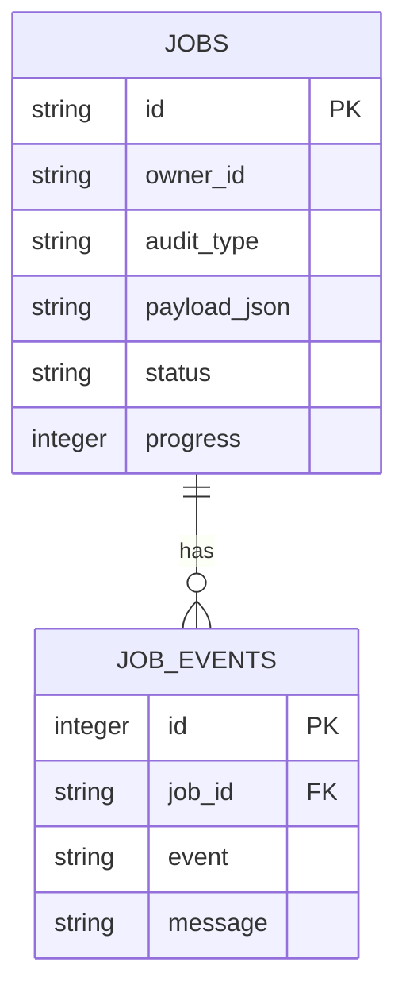

# Data Model

**Status:** Committed baseline storage model; in-progress result model called out separately
**Repository baseline:** `main @ 5d9646c4daa221f43c82cd8d477144900193bdb0`
**Last updated:** 2026-09-10
**Audience:** Developers, maintainers, and operators
**Scope:** SQLite truth, workspace/artifact JSON, and derived reports.
**Related documents:** [Architecture](ARCHITECTURE.md), [Product Specification](PRODUCT-SPECIFICATION.md), [Technical Specification](TECHNICAL-SPECIFICATION.md).

## SQLite schema

`shared/state/jobs.sqlite3` is authoritative for one application instance (or a configured `sqlite:///` path). `JobStore` owns schema version `1` and applies migration records in `schema_migrations`.

| Table / field | Type, null/default | Purpose / constraint |
| --- | --- | --- |
| `jobs.id` | TEXT, PK, not null | audit identifier |
| `owner_id`, `audit_type`, `payload_json`, `status`, `stage` | TEXT, not null | owner, mode-specific input, lifecycle state/stage |
| `progress` | INTEGER, not null, `0` | reported stage progress |
| `result_url`, `error`, failure/publication fields | TEXT, not null defaults where defined | result/failure/publication metadata |
| cancellation/artifact fields | INTEGER, not null default `0` | requested cancellation and retained-artifact state |
| timestamps/lease/worker fields | REAL/TEXT, nullable where defined | execution, recovery, retention |
| `job_events.id` | INTEGER PK AUTOINCREMENT | ordered event identity |
| `job_events.job_id` | TEXT, not null FK | references jobs; `ON DELETE CASCADE` |

Indexes: `jobs_queue_idx(status, created_at)`, `jobs_lease_idx(status, lease_expires_at)`, `jobs_owner_idx(owner_id, created_at)`, and `job_events_job_idx(job_id, id)`. SQLite foreign keys, WAL and a busy timeout are enabled.

## Source-of-truth matrix

| Information | Source / lifecycle |
| --- | --- |
| Job status, owner, progress, events, publication status | SQLite `jobs`/`job_events`; retention tombstones artifacts |
| Website input/config, collection coverage/evidence | isolated website workspace JSON/files |
| Baseline findings/scores | generated check/audit/report JSON; not SQLite |
| Normalized Figma data/issues/annotations | Figma generated JSON and images |
| Mobile screens, interactions, XML/screenshots | mobile generated directory |
| Static report/publication package | derived filesystem artifact |

## Artifact/domain schemas

| Model | Key fields | Storage |
| --- | --- | --- |
| Workspace manifest | schema version, job ID, audit type/mode, relative paths | `shared/audits/<id>/job.json` |
| Coverage manifest | discovery strategy, page records, selected/completed ratio, threshold/status | website workspace JSON |
| Figma normalized file | file metadata, pages, frames, nodes, components, tokens, warnings | Figma artifact JSON |
| Figma issue | id, axis/criterion, severity, location, evidence, visual evidence | Figma audit JSON |
| Mobile screen | app/activity, fingerprint, text/elements/tappables, screenshot/XML paths | mobile artifact JSON |
| Mobile interaction | source/target screen, action, outcome, notes | mobile artifact JSON |

**In progress - present in the working tree but not part of the repository baseline:** `result_model.py` and changed consumers define structured outcome/applicability/measurement state, stable semantic IDs, evidence records and provenance. The intended values and meanings are in [Product Specification terminology](PRODUCT-SPECIFICATION.md#core-terminology); they are not yet a committed data contract.

Generated reports are derived and may be removed by retention; they are not relational records. Missing artifact/evidence, failed collection, not measured state, and incomplete coverage are not interchangeable.
