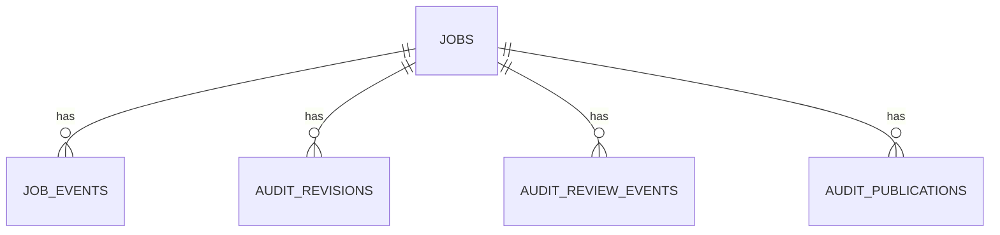

# Database Specification

**Status:** Current committed persistence contract
**Repository baseline:** `main @ b49d8ac0ca9b89da97629c734fa50d5245b5420b`
**Last updated:** 2026-09-11
**Audience:** Backend engineers, operators, and test authors
**Scope:** SQLite schema and lifecycle in `src/jobs/store.py`; conceptual ownership remains in [Data Model](DATA-MODEL.md).
**Related documents:** [Data Model](DATA-MODEL.md), [API Specification](API-SPECIFICATION.md), [Deployment](DEPLOYMENT.md).

## Engine, location, and migrations

`JobStore` is the authoritative single-instance SQLite store. The default path is `shared/state/jobs.sqlite3`; `UX_JOB_DATABASE_URL` may supply only a `sqlite:///` path. PostgreSQL and distributed mode are explicitly unsupported. Each connection enables WAL, `foreign_keys=ON`, and a 10,000 ms busy timeout. `schema_migrations(version INTEGER PRIMARY KEY, applied_at REAL NOT NULL)` records forward-only migrations owned by `JobStore._initialize`; no rollback facility is implemented.

**Current schema version: `3`.**

## Tables

| Table | Columns and constraints |
| --- | --- |
| `jobs` | `id TEXT PRIMARY KEY`; non-null `owner_id`, `owner_role DEFAULT ''`, `audit_type`, `payload_json`, `status`, `stage`, `progress INTEGER DEFAULT 0`, timestamps; result/error, cancellation, worker/lease/heartbeat, attempt/failure, publication, and artifact-retention fields with code-defined defaults. |
| `job_events` | `id INTEGER PRIMARY KEY AUTOINCREMENT`; `job_id TEXT NOT NULL REFERENCES jobs(id) ON DELETE CASCADE`; non-null timestamp, level, event, message; request/worker IDs default to empty strings. |
| `audit_revisions` | `revision_id TEXT PRIMARY KEY`; `audit_id TEXT NOT NULL REFERENCES jobs(id) ON DELETE CASCADE`; optional base revision; non-null reviewer ID/role, state, JSON changes, reason, creation time; optional validation/approval times. |
| `audit_review_events` | `id INTEGER PRIMARY KEY AUTOINCREMENT`; `audit_id TEXT NOT NULL REFERENCES jobs(id) ON DELETE CASCADE`; optional revision ID; non-null actor ID/role, event, creation time; request ID default empty. |
| `audit_publications` | `publication_id TEXT PRIMARY KEY`; `audit_id TEXT NOT NULL REFERENCES jobs(id) ON DELETE CASCADE`; optional revision ID; non-null type, publisher, timestamp, status, and `snapshot_json`; URL and failure reason default empty. |

`audit_revisions.base_revision_id`, review-event `revision_id`, and publication `revision_id` are stored identifiers but are not declared foreign keys in the schema. Only the explicitly declared job references cascade.

## Indexes and concurrency

| Index | Purpose |
| --- | --- |
| `jobs_queue_idx(status, created_at)` | FIFO queued-job selection |
| `jobs_lease_idx(status, lease_expires_at)` | expired-lease reaping |
| `jobs_owner_idx(owner_id, created_at)` | owner-scoped lookup support |
| `job_events_job_idx(job_id, id)` | ordered job events |
| `audit_revisions_audit_idx(audit_id, created_at)` | current/history revision lookup |
| `audit_review_events_audit_idx(audit_id, id)` | ordered review events |
| `audit_publications_audit_idx(audit_id, published_at)` | audit publication history |
| `audit_publications_revision_idx(revision_id, published_at)` | revision publication lookup |

Queue claims, cancellation changes, review creation/transitions, and lease reaping use `BEGIN IMMEDIATE` where implemented, serializing writers on this host. A claim updates a queued row only when it is still queued and not cancelled; heartbeats condition on job, running status, and worker ID.

## Lifecycle and JSON boundary

`jobs.payload_json` contains mode-specific request data after server-managed fields are removed. `changes_json` contains validated review changes; `snapshot_json` stores the publication snapshot. JSON is serialized with stable key ordering by the store, but the repository does not publish a separately versioned JSON schema.

Revisions are appended, not overwritten; a current revision ID is compared before creation. Review events are append-only. Publication records begin pending, then become `succeeded` or `failed`; their stored snapshot is the persistence record for publication content. Job retention tombstones eligible terminal job artifacts through `artifacts_deleted`/`expired_at` while retaining database metadata and events.

SQLite stores job and review control-plane state. Isolated workspaces hold website collection, measurement, evidence, and generated-report files; static reports are derived filesystem artifacts, not relational rows. Backups, external durable volumes, and recovery orchestration are deployment responsibilities not implemented by the repository.
