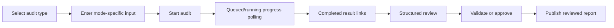

# UX Specification

**Status:** Current implemented flows plus explicitly labeled recommendations
**Repository baseline:** `main @ b49d8ac0ca9b89da97629c734fa50d5245b5420b`
**Last updated:** 2026-09-11
**Audience:** UX/UI specialists, product stakeholders, frontend engineers, and reviewers
**Scope:** User workflow in the current React application; product behavior remains authoritative in [Product Specification](PRODUCT-SPECIFICATION.md).
**Related documents:** [Product Specification](PRODUCT-SPECIFICATION.md), [Content Guidelines](CONTENT-GUIDELINES.md), [Accessibility](ACCESSIBILITY.md), [API Specification](API-SPECIFICATION.md).

## Current implemented experience

The launcher is a single-page React interface with an audit-type selector, mode-specific inputs, audit progress, result links, and a structured-review panel. It serves UX/UI specialists who create audits and product stakeholders who consume reports; authenticated admins additionally manage criteria through the API. The design favors visible state, evidence-aware reporting, and explicit review/publishing rather than silent automation.

## Primary journeys

| Journey | Current interface flow | Boundary/limitation |
| --- | --- | --- |
| Website | Select Website, enter a required URL, use the visible `Website audit` mode, then start and poll progress. | The UI exposes only `gtm`; detailed mode is an API capability subject to a workbook template. Sampling is representative, not a full crawl. |
| Screenshot | Select Screenshots, optionally name the audit, choose one or more PNG/JPEG/WebP files, then submit multipart input. | Server-enforced limits/errors apply; supplied Render disables this mode. |
| Figma | Select Figma and enter a required Figma URL. | Requires configured authorization and cannot prove runtime behavior. |
| Android/mobile | Select Mobile and enter app package, activity, and Appium URL. | Requires local Appium/device runtime; supplied Render disables it. |

After submission, the interface renders the current `status` and `stage`, polling every 1.5 seconds until `completed`, `failed`, or `cancelled`. A non-terminal job exposes **Cancel audit**. Terminal result UI shows the server-provided error/stage/status and may link to report/artifacts.

The review panel loads for any created job, shows machine-unreviewed/review status, accepts structured JSON changes, lists revision IDs, and exposes **Save revision**, **Validate**, **Approve**, and **Publish reviewed report**. Server-side rules determine valid transitions and ownership; publication remains a distinct action.

## Current feedback and friction

Implemented feedback includes disabled **Starting…** submission, form-native required/type validation, top-level alert errors, progress text, cancellation, review loading, and conflict wording. The frontend has no dedicated empty-state, unavailable-feature, or permission-specific surface beyond returned error text. `interrupted` is a persisted job state but is not terminal in the frontend polling/result lists; this is a current UX gap, not an intended flow.

## Recommended / not current behavior

| Priority | Recommendation | Evidence for need |
| --- | --- | --- |
| High | Treat `interrupted` as a terminal visible outcome with retry/support guidance. | Current poller/results handle only completed, failed, cancelled. |
| High | Surface mode availability before submission and explain Render-disabled screenshot/mobile modes. | Availability is server/deployment behavior, not a launcher state. |
| Medium | Replace raw structured-JSON editing with guided finding controls while retaining revision semantics. | Current panel exposes a textarea labeled `Finding changes (structured JSON)`. |
| Medium | Add explicit progress semantics and accessible status announcements. | Current progress is plain text, without a live region. |
| Low | Add purposeful empty/help states and clearer mode-specific constraints near inputs. | Current form relies largely on native validation and returned errors. |

These are recommendations only; no delivery date or product approval is implied.
